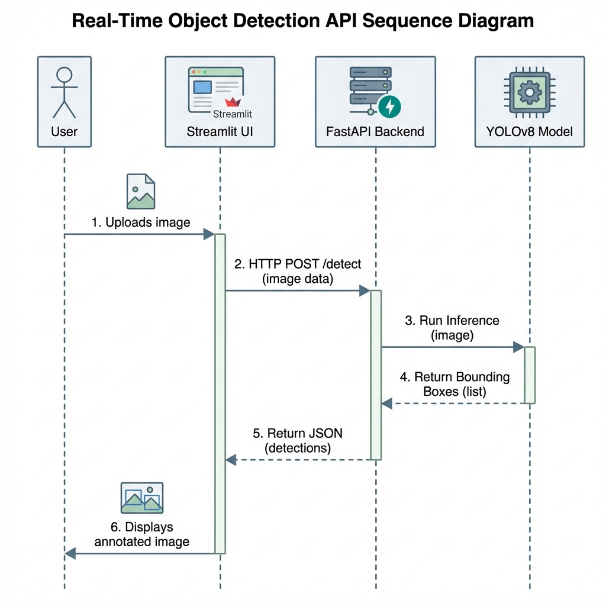

# System Architecture

This document describes the high-level architecture, components, and data flow of the Real-Time Object Detection API.

## System Overview

The application is designed as a microservices-based system using Docker for containerization. It consists of two main services:
1.  **API Service**: A FastAPI backend that hosts the YOLOv8 model and exposes REST endpoints.
2.  **UI Service**: A Streamlit frontend that provides a user-friendly interface for interacting with the API.

## Component Diagram

The following diagram illustrates the interaction between the system components running within the Docker network.

## Data Flow (Detection Request)

The sequence diagram below details the flow of data when a user performs an object detection request.

## Technology Stack

| Component | Technology | Description |
|-----------|------------|-------------|
| **Frontend** | Streamlit | Python-based web framework for rapid UI development. |
| **Backend** | FastAPI | High-performance async web framework. |
| **ML Model** | YOLOv8 (Ultralytics) | State-of-the-art real-time object detection model. |
| **Containerization** | Docker & Docker Compose | Orchestration and environment isolation. |
| **Package Manager** | uv | Extremely fast Python package installer and resolver. |

## Key Design Decisions

1.  **Separation of Concerns**: The UI and API are decoupled, allowing them to be scaled or replaced independently.
2.  **Stateless API**: The API design is stateless. While it saves the *last* annotated image to disk for debugging/persistence (via shared volume), the primary response mechanism is returning the annotated image directly in the JSON response (Base64). This allows the UI to render results immediately without needing to mount shared volumes between UI and API containers.
3.  **Non-Blocking Inference**: The API exploits FastAPI's `async` capabilities and runs the CPU-bound inference task in a thread pool (via `run_in_executor`) to prevent blocking the main event loop, ensuring the health check endpoint remains responsive during heavy processing.
